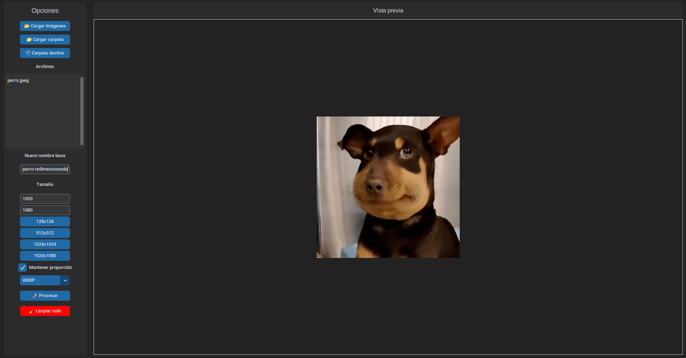

# Image Processor Pro

Aplicación de escritorio moderna desarrollada en Python para redimensionar y convertir imágenes de forma rápida y sencilla.

---

## Características

- 📂 Carga de múltiples imágenes o carpetas completas
- 📁 Selección automática de carpeta de salida (Descargas)
- 📏 Redimensionamiento personalizado
- ⚡ Tamaños rápidos (128x128, 512x512, 1024x1024, 1920x1080)
- 🔒 Mantener proporción de imagen
- 📝 Renombrado automático opcional
- 🖼️ Vista previa en tiempo real
- 📋 Lista de archivos cargados
- 📦 Conversión de formatos:
  - PNG
  - JPG
  - WEBP
  - ICO
- 🧹 Limpieza automática después del procesamiento

---

## Tecnologías

- Python 3
- CustomTkinter (UI moderna)
- Pillow (procesamiento de imágenes)

---

## Instalación

```bash
git clone https://github.com/J05U307/redimensionar_images.git
cd redimensionar_images

python3 -m venv venv
source venv/bin/activate

pip install -r requirements.txt


## Ejecucion

python main.py


## Vista previa

<p align="center">
  
</p>

